# SignLanguage-project
# Explainable Transformer Architecture for Word-Level Sign Language Classification  

## 📌 Project Overview  
This project explores a **transformer-based model** for **word-level sign language classification**, with a strong emphasis on **model explainability**. The approach utilizes **saliency maps** to analyze and interpret model decisions, improving transparency in predictions.  

## 📊 Key Highlights  
- **📚 Datasets**  
This project uses publicly available sign language datasets:

- **[AUTSL Dataset](https://cvml.ankara.edu.tr/datasets/)**  
  - Sincan, O. M., & Keles, H. Y. (2020). AUTSL: A Large Multi-Variability Dataset for Turkish Sign Language Recognition. *IEEE Transactions on Biometrics, Behavior, and Identity Science*.

- **[LSA-64 Dataset](https://facundoq.github.io/datasets/lsa64/)**  
  - Ronchetti, F., Quiroga, F., Estrebou, C., Lanzarini, L., & Rosete, A. (2016). LSA64: A Dataset for Argentinian Sign Language Recognition. *IEEE Latin America Transactions*.

🔹 If you use this work, please also **cite these datasets** accordingly.
  
- **🛠 Feature Extraction**:  
  - Used **pose estimation** and data preprocessing to extract skeletal motion features.  
  - Reduced videos to **30 frames with 258 features per frame** for efficiency.  
- **📈 Model Performance**:  
  - **AUTSL dataset**: Achieved **86.26% accuracy** using a **2-layer transformer with sinusoidal positional encoding**.  
  - **LSA-64 dataset**: Accuracy ranged between **90-94%** with optimized transformer configurations.  
- **⚡ Comparisons**:  
  - Outperformed **LSTM models** in both **accuracy and training speed**.  
- **🧐 Explainability**:  
  - **Saliency analysis** revealed the model’s focus on **active hand movements** and **mid-frame segments**.  
  - Misclassifications were linked to **overlapping hand trajectories**.  

## 🚀 Technologies Used  
- **Deep Learning Frameworks**: PyTorch  
- **Preprocessing**: MediaPipe for pose detection  
- **Evaluation**: Loss, Accuracy, confusion matrices, Captum's saliency maps,

## 📊 Data Analysis & Preprocessing
The following visualizations illustrate **average movement trajectories** in sign language datasets and the **MediaPipe-based preprocessing pipeline** used to extract skeletal motion features.

### **1️⃣ Average Movement Trajectories**

  <figure>
    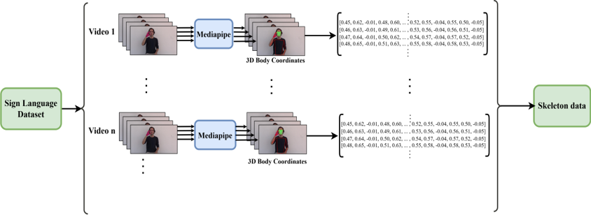
    <figcaption>Figure 1: Average movement trajectories in AUTSL subset</figcaption>
  </figure>

  <figure>
    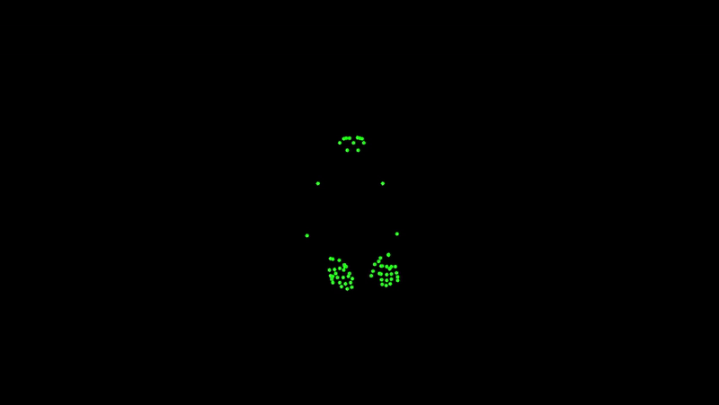
    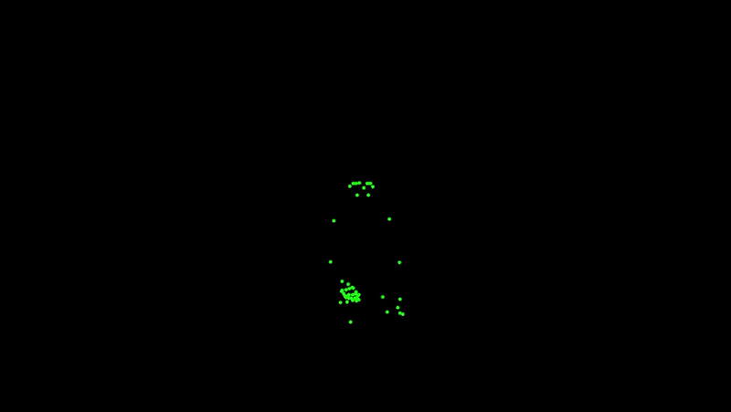
    <figcaption>Figure 1: Average movement trajectories in AUTSL subset</figcaption>
  </figure>

### **1️⃣ Average Movement Trajectories**

  <figure>
    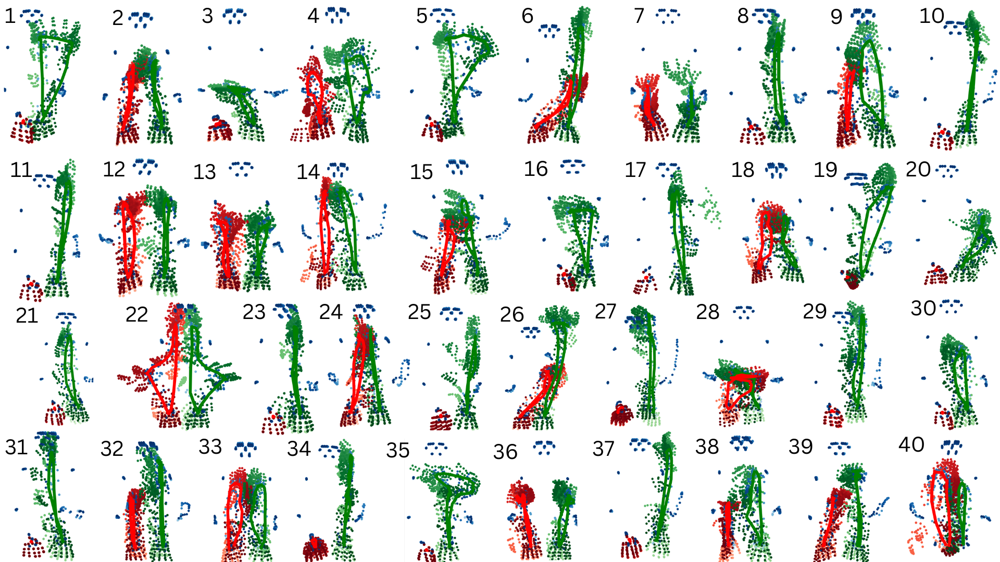
    <figcaption>Figure 1: Average movement trajectories in AUTSL subset</figcaption>
  </figure>
  <figure>
    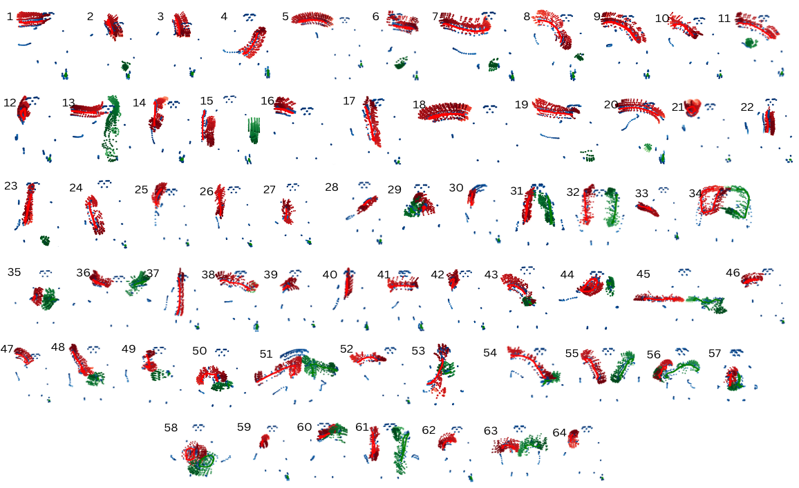
    <figcaption>Figure 2: Average movement trajectories in LSA-64 dataset.</figcaption>
  </figure>

## 📸 Sample Results  
### **2️⃣ Performance vs Hyperparameters**
## 📊 Performance vs Hyperparameters

    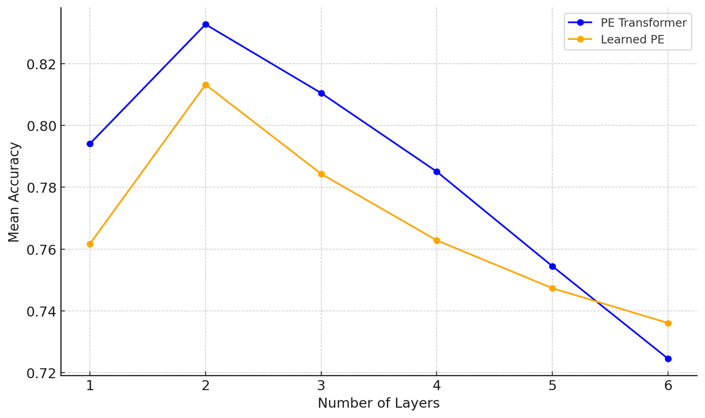
    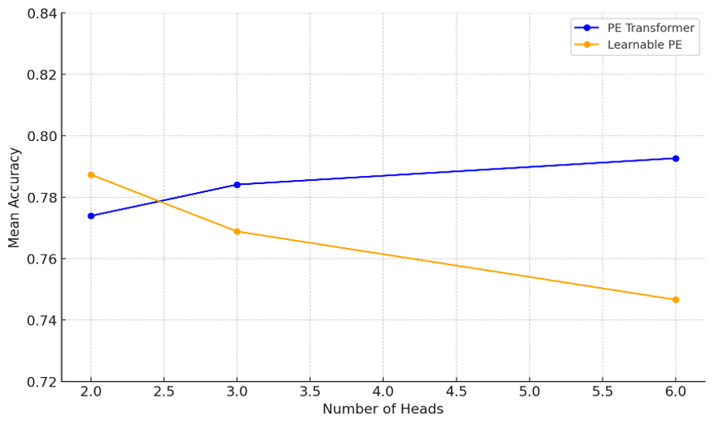
    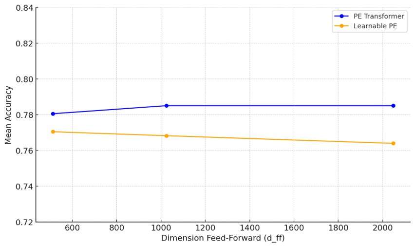

<b>Figure 3: Performance vs Number of Layers, Number of Attention-Heads, and DFF.</b>

### **3️⃣ Average Saliency Maps**

  <figure>
    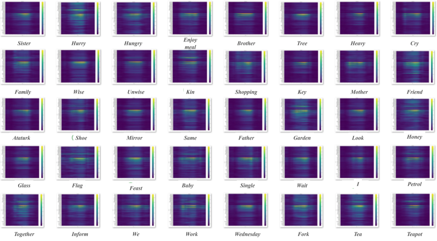
    <figcaption>Figure 6: Average saliency map for AUTSL dataset.</figcaption>
  </figure>
  <figure>
    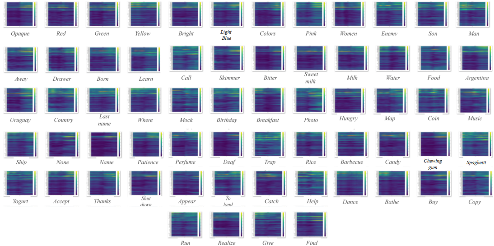
    <figcaption>Figure 7: Average saliency map for LSA-64 dataset.</figcaption>
  </figure>

### **4️⃣ Model Architecture**

  <figure>
    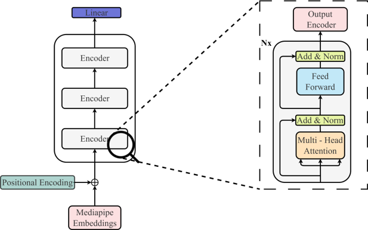
    <figcaption>Figure 8: Transformer-based model architecture for sign language classification.</figcaption>
  </figure>

 

**You can download the landmarks that were detected using mediapipe here:**
 
 
**LSA64** landmarks were extracted in 4 versions in 30, 40, 50 and 60 fps
 
**Download extracted Mediapipe landmarks and labels**
 
(https://drive.google.com/drive/folders/1AjV780y033Cy9k9PV9Y2RBOndS1sG4Fd?usp=drive_link)
 
**File path:** SignLanguageProject/data/landmarks_lsa64
 
 
 
AUTSL landmarks are only provided in 30 fps.
 
**Download extracted Mediapipe landmarks and labels**
 
(https://drive.google.com/drive/folders/1vupDY3DaFvmBdt_beXWIMqShPkHrcVeU?usp=drive_link)
 
**File path:** SignLanguageProject/data/landmarks_autsl40

**After download, please copy the downloaded files under the provided file path.**
